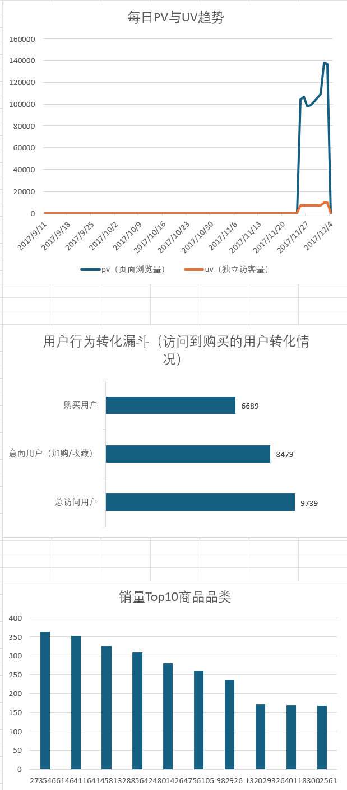

# 基于淘宝用户行为数据的漏斗分析与用户增长策略研究

## 1. 项目概述
本项目是一个端到端的数据分析项目，旨在通过分析阿里巴巴天池公开的百万级淘宝用户行为数据，运用SQL与Excel，构建用户行为转化漏斗，最终为平台的精细化运营和用户增长策略提供数据驱动的建议。

**项目核心产出:**
- 一份完整的PDF分析报告
- 一个包含3个核心模块的交互式Excel看板
- 一整套用于数据清洗与分析的SQL脚本

## 2. 技术栈
- **数据处理:** MySQL 8.0
- **数据查询:** SQL (聚合函数, WITH子句)
- **数据可视化:** Microsoft Excel (图表, 数据透视表)

## 3. 可视化看板 (Dashboard)


## 4. 分析结论与商业建议

### 核心发现
- **流量高度依赖大促：** 平台日常流量较低，增长主要由短期营销活动（11月底）驱动。
- **转化瓶颈在“临门一脚”：** 用户从“总访问”到“产生意向”的转化率高达**87.1%**，但从“意向”到“购买”的转化率下降至**78.9%**，是主要流失环节。
- **品类销售头部效应明显：** 平台的销售额高度依赖少数热门品类。

### 商业建议
- **流量策略：** 建议在平日推出主题性营销活动，并通过内容运营提升日活，实现更健康的流量结构。
- **转化策略：** 建议重点优化购物车环节，通过“购物车召回”、发放“专属优惠券”等方式刺激用户完成支付。
- **品类策略：** 建议利用头部品类的巨大流量，通过交叉推荐等方式为其他潜力品类引流，发掘新的增长点。

5. 项目文件结构
```
.
├── dashboard/ # Excel看板与截图
│ ├── 淘宝用户行为分析看板.xlsx
│ └── dashboard_screenshot.png
├── report/ # 最终PDF分析报告
│ └── 基于淘宝用户行为数据的漏斗分析与用户增长策略研究.pdf
├── sql_scripts/ # 所有SQL脚本
│ ├── 01_data_cleaning.sql
│ └── 02_analysis_queries.sql
└── README.md # 项目说明文档
